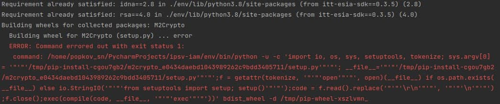
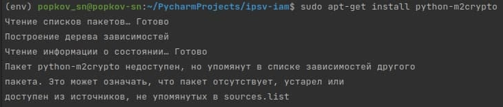

Модули `M2Crypto`
---
---

`M2Crypto` - наиболее полная оболочка Python для OpenSSL,
включающая RSA, DSA, DH, HMAC, дайджесты сообщений, симметричные шифры
(включая AES); Функциональность SSL для реализации клиентов и серверов.

При установки этой библиотеки `pip3 install -r requirements.txt` может возникнуть
следующая проблема:

Попробуйте установить библиотеку в саму систему, следующим способом 
`sudo apt-get install python-m2crypto` если ошибка все таки возникает

То используйте `sudo apt-get install libssl-dev swig python3-dev gcc`

После этого можно установить зависимость как обычно 
`pip3 install -r requirements.txt`
