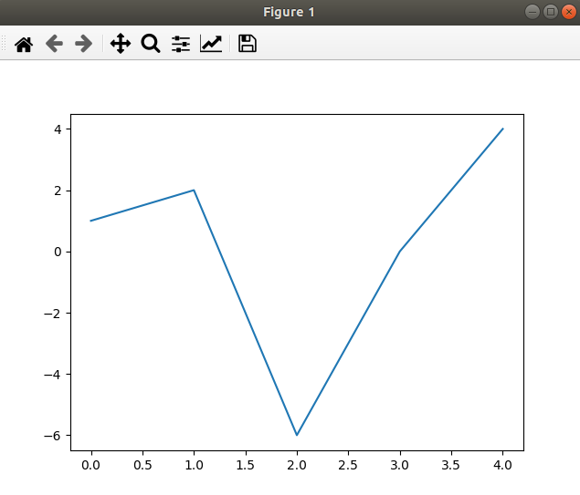
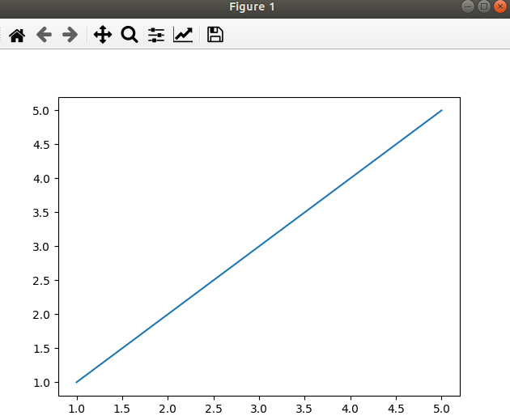
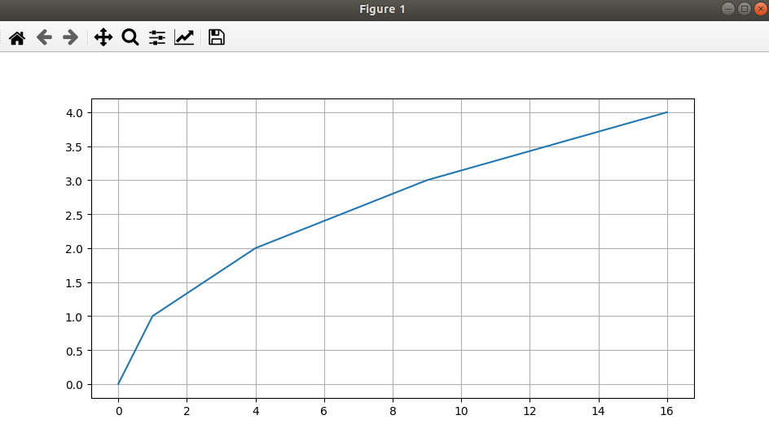
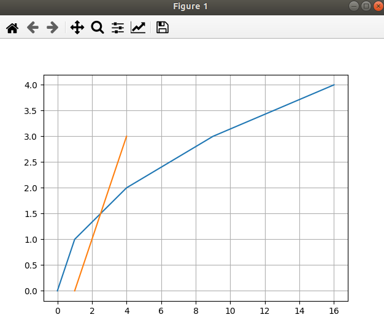
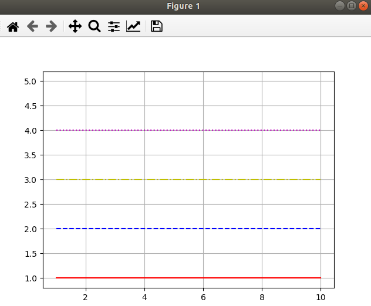
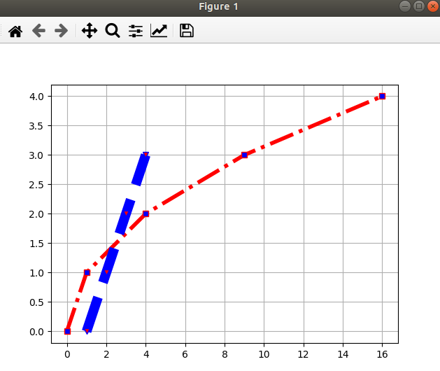

Модуль Matplotlib - №1 
---
---
Модуль используется для отрисовки графиков, диаграмм,
гистограмм ..., в кроссплатформенной библиотеке для 
разработки графического интерфейса, такие как QT или
Tkinter и прочие.

Устанавливаем:

    pip3 install matplotlib

Импортируем и выбираем программу для отображения:

```python
    import matplotlib
    import matplotlib.pyplot as plt

    # Выбор программы для отображения
    matplotlib.use('Qt5Agg')
    
    # Узнать что используется для отображения
    print('Для рисования используем = ', matplotlib.get_backend())

    # Передаем параметры для Y-оси
    plt.plot([1, 2, -6, 0, 4])
    
    # Показать график
    plt.show()
```



В результате исполнения этой программы, получим диаграмму с
рисунком, выстроенном по заданным точкам.
---

`plt.plot()` - принимает 2 списка с параметрами, для оси-X 
для оси-Y, если передан только 1 список с параметрами, то 
он будет соответствовать оси Y.

При этом, указывая только один список с координатами, для 
точек Y, точи X будут автоматически про итерированы в 
последовательности `0, 1, 2, 3, 4, 5`

Таким образом получим, если мы задаем только точки 
Y = `1, 2, -6, 0, 4` то график будет построен по точкам:

|   X   |   Y   |
| ----- |:-----:|
| 0     |    1  | 
| 1     |    2  |   
| 2     |    -6 |    
| 3     |    0  |    
| 4     |    4  |    

```python
  # Один параметр
  plt.plot(
    [1, 2, -6, 0, 4 ]  # Ось Y
    )

  # Два параметра
  plt.plot(
    [1, 2, -6, 0, 4], # Ось X 
    [1, 2,  3, 4, 5]  # Ось Y
    )
```

---

Как можно увидеть из примера мы можем передавать в функцию 
просто списки с координатами, однако `matplotlib` имеет 
полную интеграцию с модулем `numpy`. Используем метода по 
созданию массива, чтобы задать точки координат.

```python
    # Данный пример аналогичен предыдущему
    x = np.array([1, 2, 3, 4, 5])
    y = np.array([1, 2, 3, 4, 5])
    plt.plot(x, y)
    plt.show()
```


В качестве демонстрации, сгенерируем набор значений по Y,
и для каждого из них, создадим аналогичное по X, но 
умноженное на само себя.

Также для большего удобства, добавим сетку для координат,
сделать это можно при помощи функции `plt.grid()`

```python
    # Для Y генерир послед от 0 до 5 с шагом 1
    y = np.arange(0, 5, 1)
    # Для X создаем точки по Y умнож на себя
    x = [elem*elem for elem in y]

    print('x = ', x)
    print('y = ', y)

    plt.plot(x, y)
    plt.grid()
    plt.show()
```


---
Отображение 2 графиков на одной системе координат, можно 
сделать просто передавая точки нового графика по порядку,
при этом у графиков может быть разное количество точек,
все будет построено:

```python
    """Демонстрация возможностей."""
    y_1 = np.arange(0, 5, 1)
    x_1 = [elem * elem for elem in y_1]

    print('Координаты для первого графика: ')
    print('x_1 = ', x_1)
    print('y_1 = ', y_1)

    y_2 = [0, 1, 2, 3]
    x_2 = [elem +1 for elem in y_2]

    print('Координаты для второго графика: ')
    print('x_2 = ', x_2)
    print('y_2 = ', y_2)

    # Последовательно передаем коорд-ты для 2 графиков
    plt.plot(x_1, y_1, x_2, y_2)
    # Рисуем сетку
    plt.grid()
    plt.show()
```


Однако можно достигнуть такого же результата, просто 
использовав 2 раза функцию `plt.plot()` таким образом:

```python
    plt.plot(x_1, y_1)
    plt.plot(x_2, y_2)
```
Тоже будут построены 2 графика на одной системе координат.

---
`plt.plot()` - Функция имеет еще один параметр, для
кастомизации линии которой нарисован график, есть 5 варианта.

Также помимо управление штриховкой, можно управлять ее 
цветом, указывая цвет перед штриховкой, в виде символов в
низ регистре.

```python
    x_1, y_1 = [1, 10], [1, 1]
    x_2, y_2 = [1, 10], [2, 2]
    x_3, y_3 = [1, 10], [3, 3]
    x_4, y_4 = [1, 10], [4, 4]
    x_5, y_5 = [1, 10], [5, 5]

    plt.plot(x_1, y_1, 'r-')
    plt.plot(x_2, y_2, 'b--')
    plt.plot(x_3, y_3, 'y-.')
    plt.plot(x_4, y_4, 'm:')
    plt.plot(x_5, y_5, 'None')
    
    plt.grid()
    plt.show()
```


---
Мы можем управлять стилями графиков в ручную, возвращая
обьект и вызывая его метод `plt.setp()`, можем задать
стили штриховки, цвет как символ в низ регистре, RGBA,
и числовыми параметрами:

```python
    Lines = plt.plot(x_1, y_1, '-.r')

    # Можем менять стили графика в ручную
    # След 3 способа могут задавать стили графика: 
    # plt.setp(Lines, linestyle='--', color='#0000CC')
    # plt.setp(Lines, linestyle='--', color=(0, 0, 0))
    plt.setp(Lines, linestyle='--', color='g')

    plt.grid()
    plt.show()
```
---
Мы можем управлять внешним видом самих точек по которым 
строим график, указывая этот стиль после штриховки:

```python
    plt.plot(x_1, y_1, 'r-.o')
```
Тут `r` - указывает на цвет, а символ `o` - отображать 
точки координат круглыми и выпирающими, также мы можем
указывать эти стили сразу для нескольких графиков:

```python
    plt.plot(x_1, y_1, 'r-.o', x_2, y_2, 'b--o')
```
Или так:
```python
    plt.plot(x_1, y_1, 'r-.o')
    plt.plot(x_2, y_2, 'b--o')
```

Эта система маркеров имеет множество типов вот 
несколько из них:
1) `o` - шарик
2) `s` - квадратик
3) `v` - треугольник 
4) `*` - звездочка

Также можно задавать маркеры и их конкретный цвет, 
через специальные параметры `marker` и `markerfacecolor`,
а шириной графика можно управлять через спец параметр
`linewidth` который указывает ширину линии графика в 
пикселях:

```python
    y_1 = np.arange(0, 5, 1)
    x_1 = [elem*elem for elem in y_1]

    y_2 = [0, 1, 2, 3]
    x_2 = [elem +1 for elem in y_2]
    
    plt.plot(x_1, y_1, 'r-.', 
             marker='s', 
             markerfacecolor='b',
             linewidth=4
             )

    plt.plot(x_2, y_2, 'b--', 
             marker='v', 
             markerfacecolor='r',
             linewidth=10)
    
    plt.grid()
    plt.show()
```



---

Заливка областей графика.
---
Области которые ограничиваются функциями, можно 
закрашивать, 
