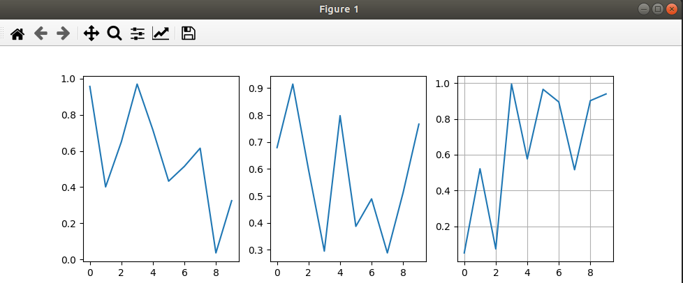

Модуль Matplotlib - №2
---
---

`subplot` - спец функция позволяет в одном окне, рисовать 
сразу несколько графиков,

```python
    # График 1
    plt.subplot(1, 3, 1)
    plt.plot(np.random.random(10))

    # График 2
    plt.subplot(1, 3, 2)
    plt.plot(np.random.random(10))

    # График 3 
    plt.subplot(1, 3, 3)
    plt.plot(np.random.random(10))

    plt.grid()
    plt.show()
```



