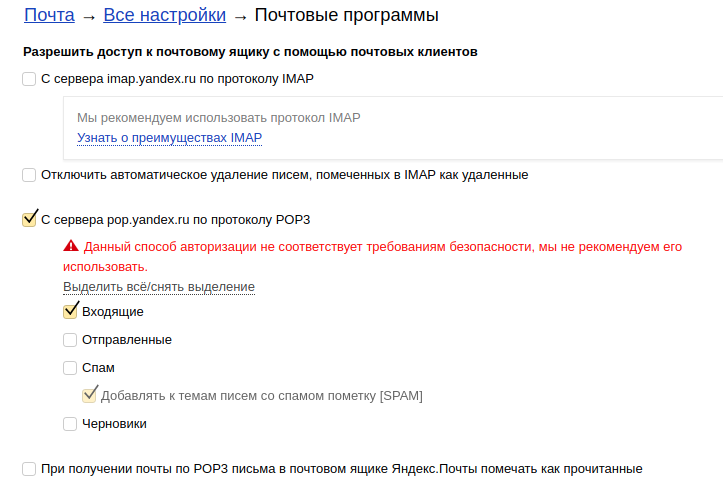
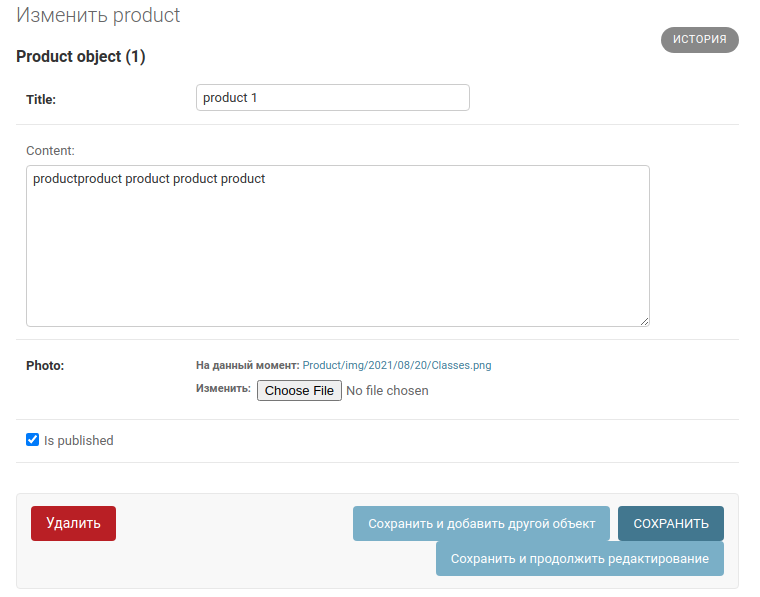
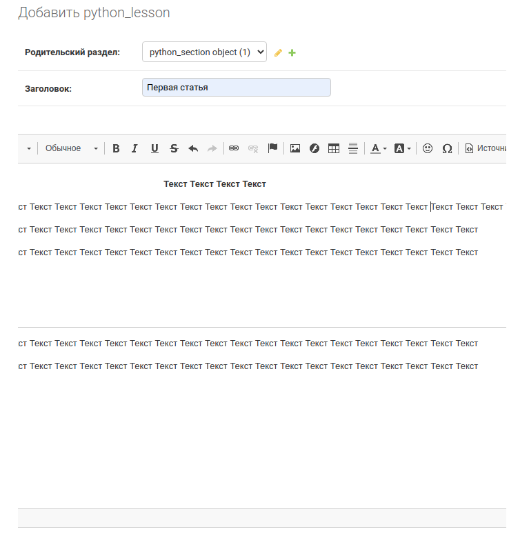

Фреймворк Django №6
---
---

Отправка Email
---

[Почитать по подробнее, про отправку Email](https://djangodoc.ru/3.2/topics/email/)

В самом python есть модуль `smtplib` я отправки почты, `Django` дает
обертку над ним, для этого используется `django.core.mail`

В файле настроек `coolsite/settings.py` определим константы для работы
почты через `smtp`:

```python
EMAIL_HOST = 'smtp.yandex.ru'
EMAIL_PORT = 465
EMAIL_HOST_USER = "Тут email который будем использовать"
EMAIL_HOST_PASSWORD = "Пароль"
EMAIL_USE_TLS = False
EMAIL_USE_SSL = True
```

Далее мы можем использовать отправку `Email` в видах:

```python
from django.core.mail import send_mail
from coolsite.settings import EMAIL_HOST_USER

def index(request):
    
    send_mail(
        'title of email: Hello World !',
        'body of email: Text',
        EMAIL_HOST_USER,
        ['Email кому отправляем'],
        fail_silently=False,
    )
    
    return render(request, 'python/section.html', context=context)
```

Также есть и другие методы для отправки писем:

`send_mass_mail` - для массовой отправки писем.

---
**Настройка Yandex**

В данном примере я использовал отправку через `smtp` сервер, от 
`yandex`  этого требуется зарегать почту на `yandex` и в настройках 
разрешить отправку почты через `smtp`



Иначе мы будем проходить аутентификацию, но не будем иметь доступ
к отправке почты, и будет получать ошибку типа

```
(535, b'5.7.8 Error: authentication failed: 
    This user does not have access rights to this service')
```

---

**Использование других SMTP серверов**

В зависимости от того, какой SMPT сервер хотим использовать
для отправки писем с сайта, нужно указывать соответствующий
хост и порт этого сервера :

Настройки для `mail.ru`

```python
EMAIL_HOST = 'smtp.mail.ru'
EMAIL_PORT = 2525
EMAIL_HOST_USER = "your@mail.ru"
EMAIL_HOST_PASSWORD = "password"
EMAIL_USE_TLS = True
EMAIL_USE_SSL = False
```

Настройки для `gmail.com`

```python
EMAIL_HOST = 'smtp.gmail.com'
EMAIL_PORT = 587
EMAIL_HOST_USER = "your@gmail.com"
EMAIL_HOST_PASSWORD = "password"
EMAIL_USE_TLS = True
EMAIL_USE_SSL = False
```

Настройки для `yandex.ru`

```python
EMAIL_HOST = 'smtp.yandex.ru'
EMAIL_PORT = 465
EMAIL_HOST_USER = "your@yandex.ru"
EMAIL_HOST_PASSWORD = "password"
EMAIL_USE_TLS = False
EMAIL_USE_SSL = True
```

---
Установка html редактора `ckeditor`
---

[Почитать про установку Ckeditor](https://alimuradov.ru/ustanovka-vizualnogo-redaktora-ckeditor-dl/)

Для админки в `Django` когда мы подключаем модели к админке, поля 
в адмике определяются на основе типа поля модели, если поле определено 
как текст `content = models.TextField(blank=True)` то это будет 
просто поле для текста.

Для того чтобы сделать из обычного текстового поля, html редактор с
которым можно будет добавлять стили и теги, есть специальный модуль,
установим его

```
pip3 install django-ckeditor
```

Далее в настройках `settings.py` в списке `INSTALLED_APPS`
добавим наши приложения:

```python
INSTALLED_APPS = [
    ...
    # Подключение html-редактора ckeditor
    'ckeditor',
    'ckeditor_uploader',
]
```

Так же добавляем и другие настройки в этот файл.

```python
# Зависимость визуального редактора
CKEDITOR_JQUERY_URL = 'https://ajax.googleapis.com/ajax/libs/jquery/2.2.4/jquery.min.js'
CKEDITOR_UPLOAD_PATH = "uploads/"
CKEDITOR_IMAGE_BACKEND = 'pillow'

CKEDITOR_CONFIGS = {
 'default': {
 'toolbar': 'Full',
 'height': 500,
 'width': 900,
 'extraPlugins':'codesnippet',
 },
}

CKEDITOR_UPLOAD_SLUGIFY_FILENAME = False
CKEDITOR_RESTRICT_BY_USER = True
CKEDITOR_BROWSE_SHOW_DIRS = True
```

Добавляем в файл `urls.py` главного ядра приложения
```python
urlpatterns = [
    ...
    
    path(r'^ckeditor/', include('ckeditor_uploader.urls')),
]
```

Теперь в файле моделях `project/models.py` заменяем поля 
`models.TextField()` которое определяло текстовое поле, на 
специальное поле из специального класса `RichTextUploadingField()` 
который мы импортируем из `ckeditor_uploader.fields`

```python
from ckeditor_uploader.fields import RichTextUploadingField

class Model_1(models.Model):
    """Модель"""
    # Другие поля модели ...
    
    # Поле заменено на специальный тип для html редактора-Ckeditor
    content = RichTextUploadingField(config_name='default', blank=True, verbose_name="Текст")
    
    # Старое поле для текста
    # content = models.TextField(blank=True, verbose_name="Текст")

    # Другие поля модели ...
```

После этого зайдя в админку, можно увидеть 

Обычное поле



Поле с ckeditor



---
Настройка отображения модели в админке 
---

Когда мы создали модели в `python/model.py`, эти модели можно 
зарегистрировать в `python/admin.py` 

`list_display_links` - что является ссылкой на сам обьект
`search_fields` - по как и с полем вести поиск в админке
`list_display` - Что показывать на дисплее админки

```python
from django.contrib import admin
from .models import python_section, python_lesson

class python_section_admin(admin.ModelAdmin):
    """Управление разделами Python уроков в админке"""
    list_display = ('id', 'title', 'time_create', 'is_published')
    list_display_links = ('id', 'title', 'time_create')
    search_fields = ('id', 'title')


class python_lesson_admin(admin.ModelAdmin):
    """Управление уроками для Python в админке"""
    list_display = ('id', 'title', 'time_create', 'is_published')
    list_display_links = ('id', 'title', 'time_create')
    search_fields = ('id', 'title')

    
# Register your models here.
admin.site.register(python_section, python_section_admin)
admin.site.register(python_lesson, python_lesson_admin)
```

