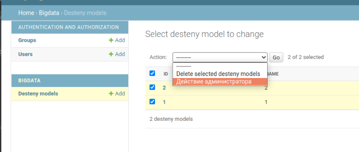

Действия администратора
---
---

Находясь на странице админки, и просматривая группу обьектов некотрой 
модели, мы можем регистрировать «действия» - функции, которые вызываются
со списком объектов, выбранных на странице списка изменений.

**Функции действия**

Создать функцию действие можно как обычную функция и зарегистрировать ее
в модели в специальном атрибуте `actions`, описание для действия можно
присвоить в классовый атрибут этой функции `function_name.short_description`

```python
from django.contrib import admin
from myapp.models import Article

def actions_for_admin(self, request, queryset):
    print('Действие администратора, далее логика')

action_for_admin.short_description = 'Действие администратора'
    
class ArticleAdmin(admin.ModelAdmin):
    list_display = ['title', 'status']
    ordering = ['title']
    actions = [actions_for_admin]

admin.site.register(Article, ArticleAdmin)
```

Все действия администратора будут доступны в выпадающем списке, рядом с
перечислением всех обьектов модели, как на рисунке.

По дефолтному поведению, действие администратора не сработает если 
не выбран хотябы один из эллементов модели.



---
